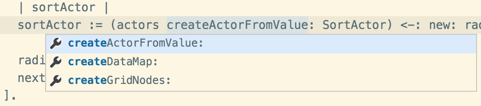
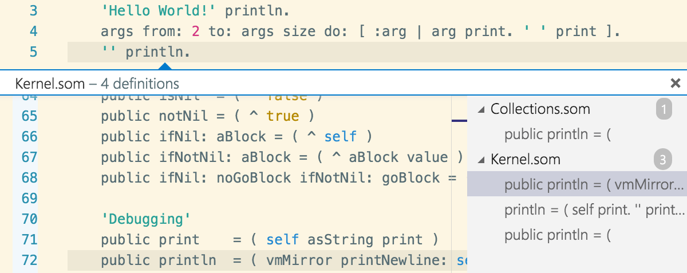
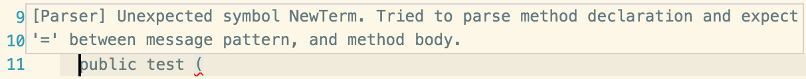
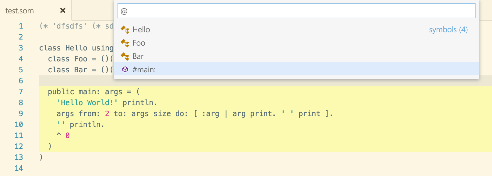

# Can we get the IDE for free, too?
# What do we need for full IDE Integration for Truffle Languages?

With the [Truffle language implementation framework][4], we got a powerful
foundation for implementing languages as simple interpreters. In combination
with the Graal compiler, Truffle interpreters execute their programs as [very
efficient native code][5].

Now that we got just-in-time compilation essentially "[for free][6]", _can we
get IDE integration for our Truffle languages as well?_

In case you wonder, this is inspired by the [language server protocol][3]
project of Microsoft, RedHat, Eclipse Che, and others. Their goal is to develop
a language agnostic protocol that connects so-called _language servers_ to IDEs.
That made me wonder whether we could provide the infrastructure needed for such
a language server as part of Truffle.

In the remainder of this post, I'll briefly discuss what IDE features would be
desirable as a start, what of that Truffle currently could support, and how far
we could got with a language-agnostic API as part of Truffle.

## Which IDE Features would be desirable?

Generally, I am thinking about features available in IDEs such as Eclipse,
Visual Studio, NetBeans, or Pharo. On the one hand, there are tools that help
to understand the execution of a program. Typically, this includes debugging
support, inspecting of values, but it can also be about profiling to identify
performance issues. Such execution-related aspects are covered by Truffle
already today. The framework comes with support for a debugger and a profiler.
The debugger can be used across Truffle languages for instance in [NetBeans][7]
or in [a web-based experiment of mine][8].

Features that are not strictly related to execution are however not supported.
In the research community, this area is something where [Language Workbench
projects][1] [[1]] excel. They often come with their own domain-specific
languages to define language grammars, and use transformation or compilation
approaches to generate from such specification a wide ranges of tools.

The tools I find most essential for an IDE include:
 - support for highlighting (syntactic and semantic)
 - code browsing, structural representation
 - code completion (incl. signature information, and API documentation)
 - reporting of parsing and compilation errors
 - reporting of potential bugs and code quality issues 
 - quick fix functionality
 - refactoring support

<figure>

</figure>

For code completion, as in the figure above, one needs of course
language-specific support, ideally taking the current context into account, and
adjusting the set of proposals to what is possible at that lexical location.

<figure>

</figure>

Similarly, for the _go to definition_ example above, it is most useful if the
language semantics are taken into account. My prototype currently does not take
into account that the receiver of a `println` in this case is a literal, which
would allow it to reduce the set of possible definitions to the one in the
`String` class.

<figure>

</figure>

Other features are more simple mappings of already available functionality. The
error message above is shown on parsing errors, and helps to understand why the
parser complains. That type of error is also shown in typical languages for
instance on the command line to enable basic programming.

<figure>

</figure>

The other features are clearly more language specific, as is the last example
above, the browsing of a file based on the entities it defines. However, most
of these elements can be mapped onto a common set of concepts that can be
handled in a language agnostic way in an IDE.

While the [DynSem][9] project might bring all these generation-based features
to Truffle languages, I wonder whether we can do more in a bottom-up approach
based on the interpreters we already got. [Ensō][2], a self-describing DSL
workbench, seems to go the route of interpretation over transformation as well.

## What does Truffle currently support? 

As mentioned already above, Truffle currently focuses on providing a framework
geared towards tooling for language execution. This focuses mainly on
providing the implementation framework for the languages themselves, but
includes also support for [language instrumentation][10] that can be used to
implement debuggers, profilers, tools for collecting dynamic metrics, [coverage
tracking][11], [dynamic code reloading][12], etc.

The framework is based on the idea that AST nodes, i.e., the basic executable
elements to which a parser transforms an input program, can be _tagged_. An
instrumentation tool can then act based on these tags and for instance add
extra behavior to a program or track its execution. AST nodes are correlated to
their lexical representation in a program by so-called `SourceSections`. A
`SourceSection` encodes the coordinates in the program file.

Unfortunately, this is where the support from the Truffle framework ends.
Tooling aspects revolving around the lexical aspects of programs are currently
not supported.

## Can we provide a language-agnostic API to implement tooling focused on lexical aspects? 

The most basic aspect that is currently missing in Truffle for any kind of
lexical support is mapping any location in a source to a corresponding semantic
entity. There are two underlying features that are currently missing for that.
First, we would need to actually retain information about code that is not part
of a method, i.e., is not part of the ASTs that are built for Truffle. Second,
we would need a simple lookup data structure from a location in the source to
the corresponding element. To implement for instance code completion, we need
to identify the code entity located at the current position in the source, as
well as its context so that we can propose sensible completion options.

Let's go over the list of things I wanted.

### Support for Highlighting (Syntactic and Semantic)

This needs two things. First, a set of common tags to identify concepts such as
keywords, literals, or method definitions. Second, it needs an API to
communicate that information during parsing to Truffle so that it is stored
along with the `Source` information for instance, and can be used for
highlighting.

To support semantic instead of purely syntactic highlighting, Truffle would
furthermore need support for dynamic tags. Currently, Truffle assumes that tags
are not going to change after AST creation. For many dynamic languages, this is
however too early. Only executing the code will determine whether an
operation is for instance a field read or an access to a global.

### Code Browsing, Structural Representation

Communicating structural information might be a bit more challenging in a
language-agnostic way. One could got with the choice of a superset of concepts
that is common to various languages and then provide an API that records these
information on a per-`Source` basis, which could then be queried from an IDE.

One challenge here, especially from the perspective of editing would be to
chose data structures that are easily and efficiently _evolvable/updatable_
during the editing of a source file. Assuming that the editor provides the
information about only parts of a source having changed, it should be possible
to leverage that.

Note, this also requires a parser that is flexible enough to parse such chunks.
This is however something that would be language-specific, especially since
Truffle leaves the parsing aspect completely to the languages.

### Code Completion (incl. signature information, and API documentation)

For code completion, one needs a mapping from the source locations to the
'lexically dominating' entities. With that I mean, not necessarily the
structure of an AST, but as with the highlighting, a mapping from the source
location to the most relevant element from a user's perspective. Assuming we
got that for highlighting already, we would need language-specific _lookup_
routines to determine the relevant elements for code completion. And those
should then probably also return all the language-specific information about
signatures (name and properties of arguments, e.g., types) as well as API
documentation.

### Reporting of Parsing and Compilation Errors

Depending on how far one wants to take that, this could be as simple as an API
to report one or more parsing or compilation exceptions.

I see two relevant aspects here that should be considered. The first is that
the current `PolyglotEngine` design of Truffle does not actually expose a
`parse()` operation. It is kept sealed off under the hood. Second, depending on
the language and the degree of convenience one would want to provide to users,
the parser might want to continue parsing after the first error and report
multiple issues in one go. This might make the parser much more complex, but for
compilation, i.e., structural or typing issues unrelated to the syntax, one
might want to report all issues, instead of aborting after the first one. Such
features might require very different engineering decisions compared to
implementations that abort on the first error, but it would improve the
programming experience dramatically.

### Reporting of Potential Bugs and Code Quality Issues

This doesn't seem to be fundamentally different from the previous issue. The
question is whether an API for querying such information is something that
belongs into the `PolyglotEngine`, or whether there should be another entry
point for such tooling altogether. Since I have a strong dynamic languages
background, I'd argue the `PolyglotEngine` is the right place. I want to
execute code to learn more about the behavior of a program. I want to run unit
tests to get the best feedback and information (including types and semantic
highlighting) about my code. So, I'd say it belongs all in there.

### Quick-Fix Functionality and Refactoring Support

I haven't really experimented with these aspects, but there seems to be a
language-specific and a language-agnostic component to it. The
language-specific component would be to identify the entities that need to be
changed by a quick fix or refactoring, as well as determining the replacement.
The actual operation however seems to be fairly language independent and could
be a services provided by a common infrastructure to change `Source`
objects/files.

## Conclusion

To me it seems that there is huge potential for Truffle to provide more
language-agnostic infrastructure to realize standard and perhaps non-standard
IDE features by providing additional APIs to be implemented by languages.
Getting basic features is something reasonably straight forward and would help
anyone using a language that doesn't already have IDE support traditionally.

However, there are also a couple of challenges that might be at odds with
Truffle as a framework for languages that are mostly tuned for peak
performance. In my own experience, adapting the SOMns parser to provide all the
necessary information for highlighting, code completion, go to definition,
etc., requires quite a few different design decisions than the straight-forward
parsing that I did before to just directly construct the AST. On the one hand,
I need to retain much more information than before. My Truffle ASTs are very
basic and contain only elements relevant for execution. For editing in an IDE
however, we want all the _declarative_ elements as well.

Another aspect is that one probably wants a parser that is incremental, and
perhaps works on the chunk that the editor identified as changed. If the parser
wasn't designed from the start to work like
that, this seems to require quite pervasive change to the parser. Similarly,
one would need a different approach to parsing to continue after a parse error
was found. On top of that comes the aspect of storing the desired information
in an efficient data structure. Perhaps that is something where persistent data
structures would be handy.

While there are challenges and tradeoffs, for language implementers like me,
this would be a great thing. I'd love to experiment with my language and still
get the benefits of an IDE. Perhaps not exactly for free, but with a reasonable
effort. While Language Workbenches provide such features, I personally prefer
the bottom up approach. Instead of specifying my language, I'd rather express
the one truth of its semantics as an interpreter. In the end, I want to execute
programs. So, let's start there.

**References**

1. Erdweg, S.; van der Storm, T.; Völter, M.; Boersma, M.; Bosman, R.; Cook, W. R.;
   Gerritsen, A.; Hulshout, A.; Kelly, S.; Loh, A.; Konat, G. D. P.; Molina, P. J.;
   Palatnik, M.; Pohjonen, R.; Schindler, E.; Schindler, K.; Solmi, R.; Vergu, V. A.;
   Visser, E.; van der Vlist, K.; Wachsmuth, G. H. & van der Woning, J. (2013),
   [The State of the Art in Language Workbenches][1], Springer, pp. 197-217.

[1]: http://homepages.cwi.nl/~storm/publications/lwc13paper.pdf
[2]: http://enso-lang.org/
[3]: https://github.com/Microsoft/language-server-protocol/
[4]: https://github.com/graalvm/truffle#readme
[5]: https://github.com/smarr/are-we-fast-yet/blob/master/docs/performance.md#performance-results
[6]: http://stefan-marr.de/papers/oopsla-marr-ducasse-meta-tracing-vs-partial-evaluation/
[7]: https://youtu.be/ewdzDqPsn38
[8]: https://vimeo.com/smarr/web-debugger-01
[9]: https://github.com/metaborg/dynsem
[10]: http://lafo.ssw.jku.at/javadoc/truffle/latest/com/oracle/truffle/api/instrumentation/package-summary.html
[11]: https://github.com/MetaConc/CoverallsTruffle#readme
[12]: http://2016.ecoop.org/event/icooolps-2016-trufflereloader-a-low-overhead-language-neutral-reloader
[13]: https://github.com/smarr/SOMns
